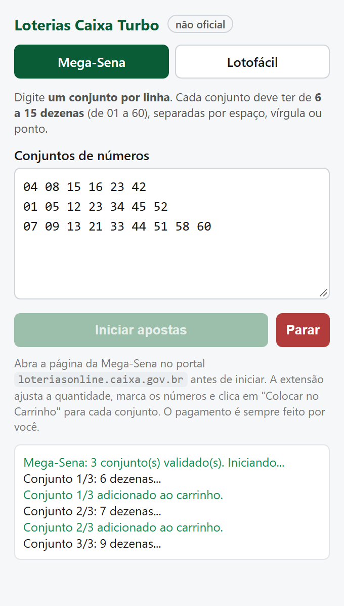
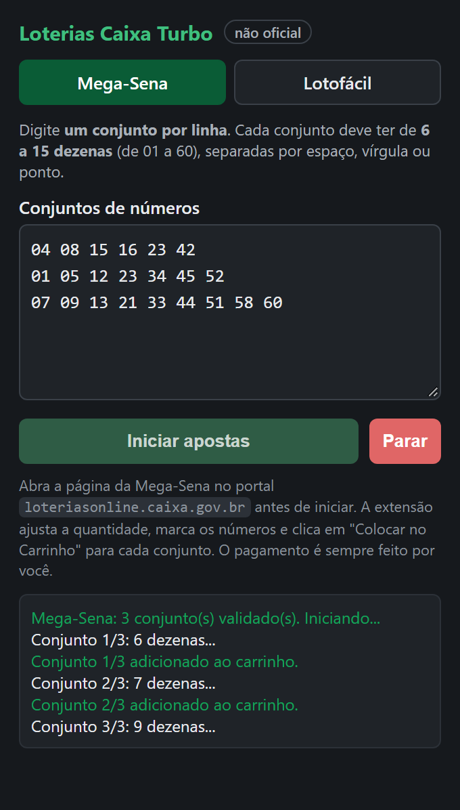
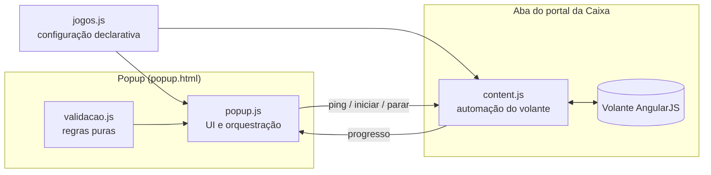
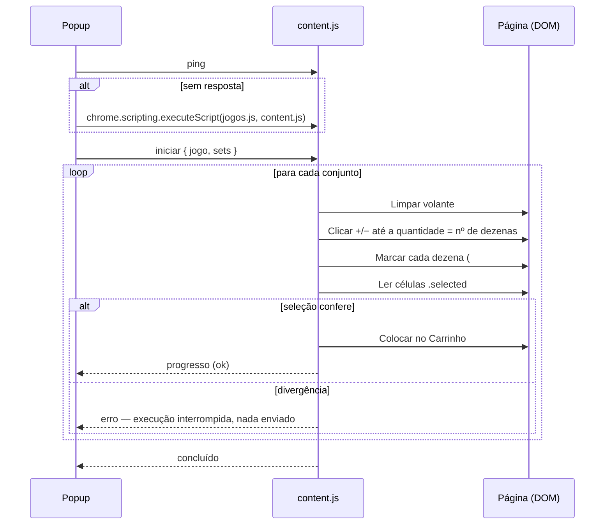

<div align="center">


# Loterias Caixa Turbo

### Auxiliar de apostas em lote para o [Loterias Online da CAIXA](https://www.loteriasonline.caixa.gov.br)

**Extensão para Chrome que registra dezenas de jogos da Mega-Sena e da Lotofácil no portal oficial de apostas da Caixa Econômica Federal em segundos — com conferência automática de cada aposta antes de ir para o carrinho.**

<sub>Projeto independente e não oficial · sem vínculo com a Caixa Econômica Federal</sub>

[](https://github.com/AGLeandro/loterias-caixa-turbo/actions/workflows/ci.yml)


[](LICENSE)

[Funcionalidades](#-funcionalidades) ·
[Arquitetura](#%EF%B8%8F-arquitetura) ·
[Decisões técnicas](#-decisões-técnicas) ·
[Instalação](#-instalação) ·
[Desenvolvimento](#-desenvolvimento)

</div>

---

## 💡 O problema

Quem aposta com bolões ou com vários conjuntos de números conhece a rotina no site da Caixa: para **cada** jogo é preciso limpar o volante, ajustar a quantidade de dezenas no `+`/`−`, clicar número por número e adicionar ao carrinho. Com 20 jogos isso vira centenas de cliques — e um único clique errado gera uma aposta errada **paga**.

O **Loterias Caixa Turbo** transforma isso em: colar a lista → clicar em *Iniciar*. A extensão faz o trabalho repetitivo e **confere cada volante antes de enviá-lo**, interrompendo tudo se algo não bater.

<div align="center">
  
  &nbsp;&nbsp;
  
  <br/>
  <sub>Popup acompanhando uma execução — temas claro e escuro seguem o sistema operacional.</sub>
</div>

## ✨ Funcionalidades

- **Entrada flexível** — um conjunto por linha; aceita espaço, vírgula, ponto ou ponto-e-vírgula como separador. Ordem e zeros à esquerda não importam.
- **Validação antes de tocar na página** — intervalo do volante, quantidade mínima/máxima de dezenas e números repetidos, com mensagem apontando a linha exata do erro.
- **Conferência pós-marcação (fail-safe)** — depois de marcar, a extensão lê o DOM e compara com o esperado. Se divergir, **nada vai para o carrinho** e a execução para.
- **Detecção automática do jogo** pela URL da aba; se o jogo escolhido não corresponder à página aberta, a extensão se recusa a marcar.
- **Progresso em tempo real** no popup e num aviso flutuante na própria página (continua visível mesmo com o popup fechado).
- **Interrupção segura** — o botão *Parar* encerra após o conjunto em andamento, nunca no meio de uma marcação.
- **Pagamento sempre manual** — a extensão só monta o carrinho; finalizar a compra é decisão do usuário.

| Jogo | Volante | Dezenas por jogo |
|---|---|---|
| Mega-Sena | 01 a 60 | 6 a 15 |
| Lotofácil | 01 a 25 | 15 a 20 |

## 🏗️ Arquitetura

Extensão **Manifest V3** sem *service worker*: o popup conversa diretamente com o *content script* da aba via `chrome.tabs.sendMessage`, e o content script devolve o progresso via `chrome.runtime.sendMessage`.



Fluxo de cada conjunto dentro da página:



### Estrutura do repositório

```
.
├── extension/              # pasta carregada no Chrome
│   ├── manifest.json       # Manifest V3, permissões mínimas
│   ├── jogos.js            # regras e seletores de cada loteria (fonte única)
│   ├── validacao.js        # parsing/validação puros — testáveis no Node
│   ├── popup.html/.js      # interface e orquestração
│   ├── content.js          # automação executada na página da Caixa
│   └── icons/
├── tests/                  # node:test — validação e integridade do manifest
├── docs/                   # imagens do README
└── .github/workflows/      # CI + release automatizada
```

## 🧠 Decisões técnicas

| Decisão | Por quê |
|---|---|
| **Verificar antes de agir, não confiar no clique** | Automação de UI é frágil. Cada conjunto é relido do DOM (`a.selected`) e comparado com o esperado antes do clique em *Colocar no Carrinho*. Uma falha custa uma execução interrompida — nunca uma aposta errada paga. |
| **Sequência `mousedown → mouseup → click`** | O volante é AngularJS e alguns controles reagem a eventos de mouse além de `click`. Disparar a sequência completa imita o usuário de forma confiável sem depender de internals do framework. |
| **Ajuste de quantidade em malha fechada** | Em vez de calcular "N cliques no +", o código lê o valor exibido a cada passo até atingir o alvo (com limite de iterações). Funciona a partir de qualquer estado inicial e tolera atrasos de renderização. |
| **Configuração declarativa por jogo** (`jogos.js`) | Intervalo, limites, rota e seletores ficam num único objeto compartilhado entre popup e página. Suportar uma nova loteria é adicionar uma entrada — sem `if/else` espalhado. |
| **Lógica pura separada da UI** (`validacao.js`) | O mesmo arquivo roda no popup (via `globalThis`) e no Node (via `module.exports`), permitindo testes unitários sem bundler nem mocks de navegador. |
| **Injeção idempotente** | Se o content script não responder ao `ping` (ex.: extensão recarregada com a aba aberta), o popup o injeta sob demanda. Guardas (`window.__megaLoteCarregado`, `globalThis.JOGOS ||=`) impedem listeners duplicados. |
| **Menor privilégio** | Apenas `scripting` + host restrito a `https://*.loteriasonline.caixa.gov.br/*`. A aba é validada pelo *hostname* (não por substring), e nenhum dado sai do navegador. |
| **Zero dependências, zero build** | O que está em `extension/` é exatamente o que roda. Fácil de auditar — importante para algo que opera numa página com carrinho de compras. |

## 📦 Instalação

**Opção 1 — release pronta**

1. Baixe o `.zip` da [última release](https://github.com/AGLeandro/loterias-caixa-turbo/releases/latest) e extraia.
2. Acesse `chrome://extensions` e ative o **Modo do desenvolvedor**.
3. Clique em **Carregar sem compactação** e selecione a pasta extraída.

**Opção 2 — a partir do código**

```bash
git clone https://github.com/AGLeandro/loterias-caixa-turbo.git
```

Depois, em `chrome://extensions` → **Carregar sem compactação** → selecione a pasta `extension/`.

> Funciona em qualquer navegador baseado em Chromium (Chrome, Edge, Brave, Opera).

## 🎯 Como usar

1. Entre em [loteriasonline.caixa.gov.br](https://www.loteriasonline.caixa.gov.br) e abra a página de aposta do jogo (a tela com o volante).
2. Clique no ícone da extensão — o jogo da página já vem selecionado.
3. Cole os conjuntos, **um por linha**:

   ```text
   04 08 15 16 23 42
   01 05 12 23 34 45 52
   07, 09, 13, 21, 33, 44, 51, 58, 60
   ```

4. Clique em **Iniciar apostas** e acompanhe o progresso.
5. Revise o carrinho no site e **finalize o pagamento você mesmo**.

## 🛠️ Desenvolvimento

Requisitos: **Node.js 22+** (apenas para os testes; a extensão não tem build).

```bash
npm test
```

```bash
npm run check
```

A suíte cobre o parsing e a validação de entrada (separadores, limites, repetições, linhas em branco, CRLF), a verificação de domínio contra URLs maliciosas e a integridade do `manifest.json`. O CI roda em cada push e pull request; ao criar uma tag `v*`, o workflow empacota `extension/` e publica a release.

### Adicionando uma nova loteria

1. Adicione uma entrada em [`extension/jogos.js`](extension/jogos.js) com `nome`, `rota`, `maiorDezena`, `minDezenas`, `maxDezenas` e o seletor `limpar`.
2. Adicione a opção correspondente no seletor de jogo em [`extension/popup.html`](extension/popup.html).
3. Os testes já validam automaticamente que o `exemplo` do novo jogo passa nas regras.

### Se o site da Caixa mudar

Os seletores foram mapeados no layout atual do portal e ficam concentrados em dois lugares: o objeto `SEL` em [`extension/content.js`](extension/content.js) e o seletor `limpar` de cada jogo em [`extension/jogos.js`](extension/jogos.js).

## 🧭 Limitações conhecidas

- Depende da estrutura HTML do portal; mudanças de layout da Caixa podem exigir atualização dos seletores.
- Os tempos de espera entre ações são fixos e calibrados para uma conexão comum.
- Na Mega-Sena o portal aceita até 20 dezenas; a extensão limita a 15 por escolha de projeto (ajustável em `jogos.js`).

## 🗺️ Próximos passos

- [ ] Importar conjuntos a partir de arquivo `.csv` / `.txt`
- [ ] Estimativa de custo total antes de iniciar
- [ ] Suporte a Quina e Dupla Sena
- [ ] Esperas baseadas em `MutationObserver` em vez de tempos fixos
- [ ] Testes end-to-end com Playwright sobre uma réplica estática do volante

## ⚠️ Aviso

Projeto pessoal e independente, **sem qualquer vínculo com a Caixa Econômica Federal**. "Mega-Sena", "Lotofácil" e "Loterias Online" são marcas de seus respectivos titulares. A extensão apenas automatiza cliques que o próprio usuário faria na interface, não contorna nenhum mecanismo de segurança e **não realiza pagamentos**. Use por sua conta e risco e respeite os termos de uso do portal.

Jogue com responsabilidade. Apostas são proibidas para menores de 18 anos.

## 📄 Licença

Distribuído sob a licença [MIT](LICENSE).

<div align="center">
<sub>Desenvolvido por <b>André Guedes Leandro</b> · <a href="https://github.com/AGLeandro">@AGLeandro</a></sub>
</div>
